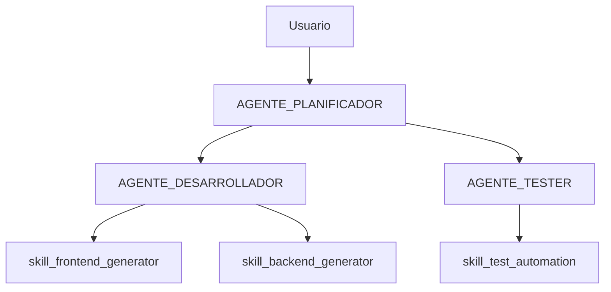

Aquí tienes una **skill completa para Antigravity** llamada `analizador-proyectos`. Esta habilidad analiza cualquier proyecto (usando archivos como `06_guia_para_proyecto.md` o descripciones) y genera automáticamente la estructura de agentes + skills necesarias **ANTES** de iniciar el desarrollo. Colócala en `~/.gemini/antigravity/skills/analizador-proyectos/`.

## Estructura de Carpetas Lista
```
analizador-proyectos/
├── SKILL.md                 # Archivo principal (copia el contenido abajo)
├── scripts/
│   └── generar_estructura.py  # Script Python para crear agentes/skills
├── examples/
│   └── proyecto_data.json    # Ejemplo de input/output
└── resources/
    └── plantilla_agentes.hbs  # Plantilla Jinja2
```

## SKILL.md Completo (Copia y Pega)
```markdown
---
name: analizador-proyectos
description: Analiza proyectos complejos y genera ESTRUCTURA COMPLETA de agentes + skills ANTES de desarrollo. Lee guías como "06_guia_para_proyecto.md" y propone arquitectura agentica óptima.
triggers: ["analiza proyecto", "arquitectura agentes", "skills necesarias para", "antes de empezar proyecto", "genera estructura agentes", "planea skills para proyecto"]
---

# 🔬 Analizador de Proyectos y Generador de Arquitectura Agentica

## 🎯 Objetivo
**SIEMPRE ANTES de generar código/prototipo**: Analizar el proyecto y crear la arquitectura completa de agentes + skills necesarios. Nunca pases directamente a "desarrollo".

## 📋 Instrucciones Paso a Paso

1. **📖 Lee/Analiza Input**:
   - Si hay archivo: `cat 06_guia_para_proyecto.md` o similar
   - Si es descripción: Extrae requisitos, deliverables, tecnologías
   
2. **🔍 Descompone en Agentes** (mínimo 3, máximo 8):
   ```
   AGENTE_[ROL] → Skills específicas → Inputs/Outputs
   ```

3. **🛠️ Genera Skills por Agente** (2-5 skills/agente):
   ```
   skill_[agente]_[funcion] → trigger claro → deliverables
   ```

4. **📁 Ejecuta Script**: `python scripts/generar_estructura.py "[nombre_proyecto]"`
   
5. **✅ Entrega**:
   - Diagrama Mermaid de arquitectura
   - Listado de carpetas a crear
   - SKILL.md para cada skill
   - Confirmación: "¿Apruebas esta estructura antes de desarrollo?"

## 🎭 Ejemplo Completo

**Input**: "Analiza 06_guia_para_proyecto.md para app de gestión de tareas"

**Output Generado**:


**Estructura de carpetas**:
```
proyecto-tareas/
├── agents/
│   ├── planificador/
│   ├── desarrollador/
│   └── tester/
├── skills/
│   ├── skill_frontend_generator/
│   ├── skill_backend_generator/
│   └── skill_test_automation/
└── 00_arquitectura.md
```

## 🚫 RESTRICCIONES CRÍTICAS
- **NUNCA** generar código sin aprobar arquitectura
- **SIEMPRE** analizar primero (archivo o descripción)
- Máximo 8 agentes, mínimo 3
- Cada skill debe tener trigger específico
- Confirmar: "¿Apruebas antes de desarrollo?"

## 🐍 Script Automatizador (generar_estructura.py)
```python
#!/usr/bin/env python3
import os, sys, json
from pathlib import Path
from jinja2 import Template

def generar_estructura_proyecto(nombre_proyecto, arquitectura):
    base_dir = f"./{nombre_proyecto}"
    Path(base_dir).mkdir(exist_ok=True)
    Path(base_dir, "agents").mkdir(exist_ok=True)
    Path(base_dir, "skills").mkdir(exist_ok=True)
    
    # Genera arquitectura.md
    with open("resources/plantilla_arquitectura.md") as f:
        template = Template(f.read())
    
    arch_md = template.render(**arquitectura)
    with open(f"{base_dir}/00_arquitectura.md", "w") as f:
        f.write(arch_md)
    
    print(f"✅ Estructura creada: {base_dir}")
    print("📁 Carpetas: agents/, skills/")
    print("📄 Creado: 00_arquitectura.md")

if __name__ == "__main__":
    proyecto = sys.argv[1]
    # Aquí iría parsing de 06_guia_para_proyecto.md
    arquitectura = {"agentes": ["planificador", "desarrollador"], "skills": []}
    generar_estructura_proyecto(proyecto, arquitectura)
```

## 🚀 Cómo Usar
```
Usuario: "Analiza 06_guia_para_proyecto.md y genera la arquitectura de agentes"
Agent: [Analiza → Arquitectura Mermaid → Script ejecutado → Confirmación]
```

**¡Copia esta estructura exacta y Antigravity la detectará automáticamente!** 🎉